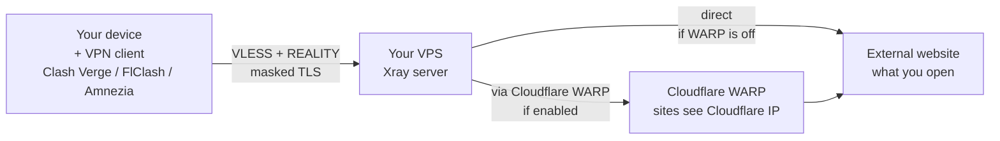

**Version:** v0.4.2 · **Last updated:** 2026-09-13

[](README.md)
[](README.en.md)

---

# Xray Reality VPN Server — deployment

> A personal VPN server on your own VPS (cloud server) — the minimal case needs only the IP and root password passed as parameters. Automated setup of VLESS Xray Reality VPN + Cloudflare WARP outbound (optional) via Ansible. Generates and downloads ready .json/.yaml configs for Amnezia / Clash Verge / FlClash into the project directory.

## Table of contents

- [Hi](#hi)
- [Quick start](#quick-start)
- [Who this is for](#who-this-is-for)
- [What it does](#what-it-does)
- [Why this approach](#why-this-approach)
- [Where it runs](#where-it-runs)
- [Requirements](#requirements)
- [Configuration](#configuration)
- [Clients](#clients)
- [Detailed documentation](#detailed-documentation)
- [License](#license)
- [Author and contacts](#author-and-contacts)

## Hi!

Hi, I'm [Tim Korelov](https://korelov.dev). Here is my solution for deploying a personal VPN that you can use freely and free of charge (solely to protect your personal data, naturally, and in accordance with all laws). Don't forget to check the license terms.

> [!TIP]
> Want to jump straight in? — [Quick start](#quick-start).

Why did I build this? My server, my rules. I wanted a personal VPN where:
- nobody listens to my traffic or logs my data
- I don't have to buy a service from someone who might go down or change terms tomorrow
- I see with my own eyes what happens on my server and why, instead of trusting someone else's word
- I can update its components and customize it any time I want, for example add a tunnel or extra services

Everything is automated on purpose, so it can be reused rather than configured by hand every time.

I went with Ansible — more on why below.

<details>
  <summary>Why Ansible (details for techies)</summary>

  Ansible is a mature automation tool. It's idempotent: running it again doesn't break the state, it brings the server to the desired state. It's extensible — roles and plugins are already written and tested, no need to write them from scratch. It shows exactly what changes at each step and touches nothing until you ask. It's declarative (but allows imperative parts). The logic is already there: I just describe the desired server state through ready-made modules.

  Ansible runs on your machine in the local scenario (inside WSL on Windows) and executes commands on the server over SSH. In the remote scenario Ansible is installed on the VPS itself — then no local setup is needed.

</details>

This project isn't a one-time test — I (and many other people) use it constantly, because I built it first and foremost for myself. If something breaks, it breaks for me too, so I fix it quickly.

But if I missed something, something broke for you, it doesn't start at all, or you have suggestions — create a new issue. If an already-deployed VPN stopped working — start with [`docs/RUNBOOK.en.md`](docs/RUNBOOK.en.md).


## Quick start

The simplest path is the standalone binary — no Python, no Ansible: download the portable build for your platform (`xrayvpn-<version>-windows-x64-portable.exe`, `xrayvpn-<version>-linux-x64-portable`, `xrayvpn-<version>-linux-arm64-portable`, `xrayvpn-<version>-macos-arm64-portable`) from the [Releases section](https://github.com/lifestreamy/xrayvpn/releases), put it in a regular folder (not a synced drive) and run it — on Windows just double-click. A console assistant opens: type `deploy`, it interactively asks for the VPS IP and (hidden) password; `ru` switches the interface to Russian. Configuration files (`config/settings.yml`, `inventory.yml`) may live next to the binary — see [`docs/SETUP.en.md`](docs/SETUP.en.md), the "Standalone binary" section.

For those who work with the repository there are three clients and a direct playbook run. Parameters are optional: the client can be run with no arguments at all — `xrayvpn deploy` interactively asks for the execution mode (default `remote`) and the VPS IP, then requests the password with hidden input. The minimal case — just the VPS IP.

You can run it with one of three clients, or with none:

- `xrayvpn` (Python) — [`python-client/`](python-client/README.en.md) — Windows, Linux and macOS; recommended among the script clients;
- Bash — [`shell-clients/bash/provision-vpn.sh`](shell-clients/bash/provision-vpn.sh) — Linux / WSL (supported, not developed further);
- PowerShell — [`shell-clients/powershell/Provision-VPN.ps1`](shell-clients/powershell/Provision-VPN.ps1) — Windows + WSL;
- Ansible directly — `ansible-playbook -i inventory.yml deploy.yml`, no client.

### About configuration

IP and password are enough — everything else configures itself. If you need to change something (number of clients, WARP, port, camouflage domain), additional configuration is done through two files:

- `inventory.yml` — VPS connection (created from `inventory.yml.example`).
- `config/settings.yml` — server parameters: `num_clients`, `warp_enabled`, `xray_port`, `reality_camouflage_domain` and others.

More about each file — in [`docs/SETUP.en.md`](docs/SETUP.en.md), the "Configuration files" section.

<details>
<summary>xrayvpn (Python) — commands</summary>

The `xrayvpn` Python client works identically on Windows, Linux and macOS; remote mode does not need WSL.

```bash
# Remote mode (VPS). Just the IP — the password is prompted with hidden input.
uv run --project python-client xrayvpn deploy --execution remote --host 1.2.3.4
uv run --project python-client xrayvpn deploy --execution remote --use-inventory
```

No `uv`? One-line install: Windows — `powershell -ExecutionPolicy ByPass -c "irm https://astral.sh/uv/install.ps1 | iex"`, Linux/macOS — `curl -LsSf https://astral.sh/uv/install.sh | sh`.

Want to type `xrayvpn` without the `uv run` prefix? Install the command onto PATH: `uv tool install --editable python-client` from the repository root; run it from the repository folder (details in [`python-client/README.en.md`](python-client/README.en.md)).

The rest (`--pkey`, ansible node `--execution local|remote`, the deploy-plan confirmation, client scenarios) — in [`python-client/README.en.md`](python-client/README.en.md).

</details>

<details>
<summary>Bash — commands</summary>

On Windows, WSL with an Ubuntu/Debian image must be available — how to check and set it up, see [`docs/SETUP.en.md`](docs/SETUP.en.md). If Ubuntu is installed in WSL, you'll see the icon in the Start menu. If you're already on Linux, you hardly need an explanation of how to use a terminal. On Windows — find powershell or terminal via search (Win + S).

```bash
./shell-clients/bash/provision-vpn.sh -H 1.2.3.4
./shell-clients/bash/provision-vpn.sh -H 1.2.3.4 --pkey ~/.ssh/id_rsa
./shell-clients/bash/provision-vpn.sh --use-inventory
```

</details>

<details>
<summary>PowerShell — commands</summary>

How to open a command line: Start → type "PowerShell" → Enter. Go to the project folder:

```powershell
cd C:\path\to\project
```

(replace `C:\path\to\project` with the real path where you unpacked the files)

```powershell
.\shell-clients\powershell\Provision-VPN.ps1 -HostName 1.2.3.4
.\shell-clients\powershell\Provision-VPN.ps1 -HostName 1.2.3.4 -PKey C:\Users\You\.ssh\id_rsa
```

</details>

<details>
<summary>Ansible directly — commands</summary>

You need ansible-core 2.14+ and the `community.general` collection. Prepare `inventory.yml` from the template (commands — in the "Configuration" section below):

```bash
# Debian 12+ / Ubuntu 24.04: apt works too. On Ubuntu 22.04 apt ships 2.12 — use pip.
pip install ansible-core
ansible-galaxy collection install community.general
ansible-playbook -i inventory.yml deploy.yml
```

In this mode client configs are not downloaded — they stay on the VPS in `/root/vpn-configs`.

</details>

## Who this is for

For those who want their own VPN and don't want to rely on third-party services. It doesn't matter whether you know Ansible, Xray, VPN or servers — the script does everything. If you want to dig deeper, technical details are in collapsible blocks and in [`docs/`](docs/GLOSSARY.en.md).

## What it does

- Sets up a VPN server on your VPS with a single script run.
- Your data goes only through your server, encrypted — nobody but you reads or logs it. On your own server you're sure only you see the traffic. With a public VPN service there's no such certainty, especially on a „free" tier.
- You're not tied to a VPN provider: not its uptime, terms, price or other limits. No shared channel with other users.
- Full customization — it's your server, you decide which features you need and in what form.
- Generates ready client configs: Clash Verge / FlClash / Amnezia.



The end goal is the external website. It sees your VPS IP (direct) or Cloudflare IP (via WARP).

> I'm planning my own cross-platform client with a simple interface to make deployment and management even easier. The full list of plans is in [docs/PLANNED.en.md](docs/PLANNED.en.md).

<details>
  <summary>Tech stack details</summary>

  Real stack: Ansible role `roles/xray_vpn/`, Jinja2 templates,
  Docker image `teddysun/xray:26.6.27`, persistent state
  `/root/xray-config/reality-state.json`. Transport — VLESS + REALITY
  (modified TLS 1.3, X25519). Optionally — outgoing tunnel through
  Cloudflare WARP.

</details>

## Why this approach

Xray VLESS + REALITY needs no domain of your own or a TLS certificate. The server masks itself as a legitimate third-party site (`reality_camouflage_domain`, default `dl.google.com`). This removes the main barrier to setting up a VPN yourself: no domain purchase, no certificate issuance and renewal, no DNS setup.

The server core is [Xray-core](https://github.com/XTLS/Xray-core). By default it is installed natively as `/usr/local/xray/xray` managed by systemd (`xray_runtime: native` in `config/settings.yml` — smallest footprint, recommended). The `docker` variant is also available (legacy escape hatch via Docker Engine). The whole stack (VLESS + REALITY) runs on it.

Three things are needed from you:
- buy a VPS (Ubuntu 20.04+ or Debian 11+) — I can point you to trusted providers, and I'd appreciate registration via my referral link
- download the project files
- run a client or the playbook — commands are in the [Quick start](#quick-start) section above.

> To get the files: the **Code → Download ZIP** button on the repository page, or the source archive in the **Releases** section (on the right). Then the client deploys Xray on the VPS, generates client configs and downloads them to you. In remote mode the Ansible environment is bootstrapped right on the server — nothing needs to be installed locally. No Ansible, SSH or Xray knowledge required. BUT basic command-line skills are needed to run the client with parameters.

WARP outbound via Cloudflare is enabled with one line (`warp_enabled: true` in `config/settings.yml`). With it, sites see Cloudflare IP instead of your VPS IP.

Before paying for a VPS long-term, check it with [`carrox-vps-check`](https://github.com/AiCarrox/carrox-vps-check) or a similar tool. Details — in [`docs/TEST-VPS.en.md`](docs/TEST-VPS.en.md).

## Where it runs

Run paths and platform requirements — in the "Quick start" above.

## Requirements

**VPS:** fresh Ubuntu 20.04+ or Debian 11+, root or sudo, public IP.

**Local machine:**

- Python 3.12+ for the main `xrayvpn` client (install/run via `uv`, see [`python-client/README.en.md`](python-client/README.en.md)); SSH access to the VPS by key or password (uses the built-in `paramiko` — no `sshpass` needed).
- For the alternative shell clients: Linux/WSL with `apt`; on Windows — WSL2 with Ubuntu/Debian.

The wrapper installs Python 3, Ansible and `sshpass` itself if they are missing. On Windows only WSL is needed.

## Configuration

Two ways:

- **CLI parameters** — `--pkey` or `--pass` (mutually exclusive). If neither is set, the password is requested with hidden input.
- **Inventory file** — `inventory.yml` + `--use-inventory` (`-UseInventory` in PowerShell). The shell clients also accept an explicit path: `--inventory PATH` (`-Inventory <path>`). Mode details — in [`docs/SETUP.en.md`](docs/SETUP.en.md), the "`xrayvpn deploy` CLI flags" section.

For `--use-inventory` mode you need an `inventory.yml` file in the project root. The repository has an `inventory.yml.example` template — copy it and fill in your data:

```bash
cp inventory.yml.example inventory.yml
```

Windows PowerShell equivalent:

```powershell
Copy-Item inventory.yml.example inventory.yml
```

Fill in `ansible_host`, `ansible_user`, `ansible_port` and one of the two: `ansible_ssh_private_key_file` or `ansible_ssh_pass`. The `inventory.yml` file is in `.gitignore` — your personal data won't reach git.

CLI mode (`-H` without `--use-inventory`) doesn't use `inventory.yml` — the script builds its own inventory in a temp folder for the duration of the run.

These are ways to pass connection parameters. The rest of the configuration (number of clients, WARP, port, camouflage domain) is set in `config/settings.yml` — more in [`docs/SETUP.en.md`](docs/SETUP.en.md), the "Configuration files" section.

## Repository layout

- `python-client/` — the main client (Python, `xrayvpn` CLI): always deploys to a VPS; ansible
  runs on the server (default) or on your own machine (`--execution local`).
- `shell-clients/` — alternative shell clients: Bash and PowerShell (supported, but no longer developed).
- `scripts/` — developer tooling: test environment setup and local tests.
- `config/`, `roles/`, `deploy.yml` — the Ansible project (configuration, role, playbook entry point).

## Clients

I use Clash Verge (Windows) and FlClash (Android). Amnezia works, but because of instability I recommend Mihomo clients. A table of what I tested myself and what I didn't — [`docs/CLIENT-STATUS.en.md`](docs/CLIENT-STATUS.en.md).

## Detailed documentation

- [`docs/SETUP.en.md`](docs/SETUP.en.md) — setup, `config/settings.yml` variables, WARP, post-deployment checks.
- [`docs/RUNBOOK.en.md`](docs/RUNBOOK.en.md) — what to do when the VPN stops working.
- [`docs/ROTATION.en.md`](docs/ROTATION.en.md) — rotating keys and client UUIDs.
- [`docs/TEST-VPS.en.md`](docs/TEST-VPS.en.md) — checking a VPS before paying.
- [`docs/GLOSSARY.en.md`](docs/GLOSSARY.en.md) — project terms.
- [`docs/CLIENT-STATUS.en.md`](docs/CLIENT-STATUS.en.md) — client status.
- [`docs/PLANNED.en.md`](docs/PLANNED.en.md) — what's planned next.
- [`docs/RELEASE.en.md`](docs/RELEASE.en.md) — release policy and release statuses.
- [`CHANGELOG.en.md`](CHANGELOG.en.md) — changes by version.

## License

AGPL-3.0 with an additional commercial-use restriction.

Free for personal use and non-commercial distribution. Commercial use — only with my written permission: **tim.korelov@yandex.com**.

Full text — in [`LICENSE`](LICENSE) (English). A short summary in Russian — in [`LICENSE.ru.md`](LICENSE.ru.md).

## Author and contacts

Tim Korelov — https://korelov.dev

Email: **tim.korelov@yandex.com**
Telegram: **@timkore** (work) — about this project, with proposals to work together, invitations, etc.
