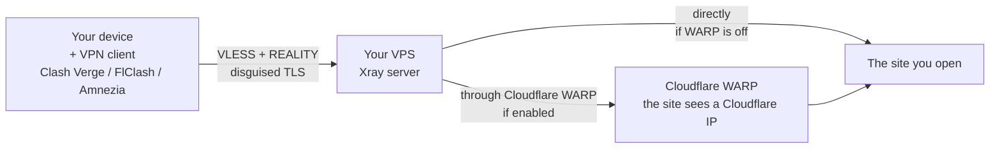

[](README.md)
[](README.en.md)

<p align="center">
  
</p>

# Xray Reality VPN Server — deployment

[](https://github.com/lifestreamy/xrayvpn/releases/latest)
[](https://pypi.org/project/xrayvpn/)
[](python-client/README.en.md)
[](LICENSE)

> VLESS Xray Reality with an optional Cloudflare WARP outbound. A personal VPN on your own VPS
> running Ubuntu/Debian — no domain to buy, just an IP and the root password.
> A console Python client for every platform (Ubuntu/Debian/Arch | Windows | macOS): a ready build
> file or a terminal run; install via pip or apt (Ubuntu 24.04 / Debian 12).
> Ansible powers the deployment. Finished client configs (Amnezia / Clash Verge / FlClash) are
> generated and downloaded to your machine. What comes next — [plans](docs/user/PLANNED.en.md).

<table>
  <tr>
    <td></td>
    <td></td>
  </tr>
</table>

## Table of contents

- [Hi!](#hi)
- [Quick start](#quick-start)
- [Who this is for](#who-this-is-for)
- [What it does](#what-it-does)
- [Why this approach](#why-this-approach)
- [Requirements](#requirements)
- [Configuration](#configuration)
- [Repository layout](#repository-layout)
- [Clients](#clients)
- [Detailed documentation](#detailed-documentation)
- [License](#license)
- [Author and contacts](#author-and-contacts)

## Hi!

Hi, this is [Tim Korelov](https://korelov.dev). I'm sharing my way of running a personal VPN —
use it freely to protect your own data and within the laws of your country. Mind the license rules.

> [!TIP]
> [Quick start](#quick-start).

Why I built this? My server, my rules:

- nobody watches or logs anything; I take no one's word for it — I control what happens on the
  server and where the traffic goes;
- someone else's service can change its terms or vanish any day, especially with a big client base;
- bandwidth on such a service is shared unevenly — users affect each other;
- components can be updated and the service tuned to my needs any time.

It's all automated, so nothing is ever set up by hand again.

<details>
<summary>Ansible</summary>

Why:

- idempotent: a rerun doesn't break the server, it brings it to the wanted state;
- extensible with roles and ready-made modules;
- shows every change;
- declarative: you describe the state, not the command sequence. It also allows imperative code.

It runs on the VPS (remote mode) or from your machine (local mode; on Windows — via WSL).
</details>

The project is fully covered by automated tests on all platforms; I also test it by hand and polish
the UI/UX before every release, so everything works as it should and stays easy to use; the docs get
a readability pass too.

And, most importantly — I use the app myself (the so-called "dogfooding"), so breakage hits me
first and gets fixed right away.

Found a bug or something doesn't run from the start? Open an issue or try discussions. If a working
VPN stopped — start with [`docs/user/RUNBOOK.en.md`](docs/user/RUNBOOK.en.md).

## Quick start

| Path | What you need | How | Comment |
|---|---|---|---|
| Portable app | one downloaded file, nothing to install | download from [Releases](https://github.com/lifestreamy/xrayvpn/releases/latest) and run it (double-click on Windows), type `deploy` | console app |
| Package managers | a package manager | `pip install xrayvpn` (Python 3.12+), apt (Ubuntu 24.04 / Debian 12) | one-command install |
| From the repository | `uv` (installs Python 3.12+) | `uv run --project python-client xrayvpn deploy` | running from source |
| Shell wrappers | Linux/WSL (bash) or Windows+WSL (PowerShell) | `provision-vpn.sh` / `Provision-VPN.ps1` | maintained, not developed |
| Ansible directly | ansible-core 2.14+ and `community.general` | `ansible-playbook -i inventory.yml deploy.yml` | for techies |

What you need either way: a VPS (fresh Ubuntu 20.04+/Debian 11+, root/sudo, a public IP) and SSH
access to it — a password or a key. Install guide — [`docs/user/SETUP.en.md`](docs/user/SETUP.en.md).

<details>
<summary>Install per platform — commands</summary>

**Windows:** download `xrayvpn-<version>-windows-x64-portable.exe` from
[Releases](https://github.com/lifestreamy/xrayvpn/releases/latest) and double-click it.

**macOS (Apple Silicon):** download `xrayvpn-<version>-macos-arm64-portable`:

```bash
chmod +x xrayvpn-*-macos-arm64-portable
./xrayvpn-*-macos-arm64-portable
```

**Linux (Ubuntu 24.04 / Debian 12)** — the apt repository:

```bash
sudo curl -fsSL -o /usr/share/keyrings/xrayvpn-archive-keyring.gpg \
  https://lifestreamy.github.io/xrayvpn/apt/xrayvpn-archive-keyring.gpg
echo "deb [signed-by=/usr/share/keyrings/xrayvpn-archive-keyring.gpg] https://lifestreamy.github.io/xrayvpn/apt/ $(. /etc/os-release; echo $VERSION_CODENAME) main" \
  | sudo tee /etc/apt/sources.list.d/xrayvpn.list
sudo apt update && sudo apt install xrayvpn
```

Key fingerprint: `60DA D207 F0BE 147C 5830 D3D8 1BD4 9EC3 0480 57D3`.
Other distributions — the ready builds from Releases (`chmod +x`, run
`./xrayvpn-*-linux-x64-portable`) or the `.deb`: `sudo apt install ./xrayvpn_*_amd64.deb`.

**Any OS with Python 3.12+:** `pip install xrayvpn`; on Debian/Ubuntu the system pip is locked
down — `sudo apt install pipx && pipx install xrayvpn`.

</details>

The app is a console tool — feel free to mistype commands, nothing breaks.

- `ru` switches the interface to Russian; `help` shows the main help in the current language.
- `deploy` is the main command; `deploy --help` documents it. With no arguments `deploy` asks for the
  VPS IP and the password (hidden), shows the plan and runs it after confirmation.
- `service` reports on the system and the deployment, e.g. `service status`.

<details>
<summary>Python client from the repo — commands</summary>

Works the same on Windows, Linux and macOS; remote mode needs no WSL.

```bash
# Remote mode (the VPS). The IP is enough — the password is asked, hidden.
uv run --project python-client xrayvpn deploy --execution remote --host 1.2.3.4
uv run --project python-client xrayvpn deploy --execution remote --use-inventory
```

No `uv`? Windows: `powershell -ExecutionPolicy ByPass -c "irm https://astral.sh/uv/install.ps1 | iex"`,
Linux/macOS: `curl -LsSf https://astral.sh/uv/install.sh | sh`.

To get a bare `xrayvpn` in PATH, run `uv tool install --editable python-client` from the
repository root and start it inside the repo. More in [`python-client/README.en.md`](python-client/README.en.md).

</details>

<details>
<summary>Shell wrappers — commands</summary>

On Windows the bash wrapper needs WSL with Ubuntu/Debian (open a terminal: Win + S → "PowerShell" or
"Terminal"; details — [`docs/user/SETUP.en.md`](docs/user/SETUP.en.md)).

```bash
./shell-clients/bash/provision-vpn.sh -H 1.2.3.4
./shell-clients/bash/provision-vpn.sh -H 1.2.3.4 --pkey ~/.ssh/id_rsa
./shell-clients/bash/provision-vpn.sh --use-inventory
```

```powershell
.\shell-clients\powershell\Provision-VPN.ps1 -HostName 1.2.3.4
.\shell-clients\powershell\Provision-VPN.ps1 -HostName 1.2.3.4 -PKey C:\Users\You\.ssh\id_rsa
```

</details>

<details>
<summary>Ansible directly — commands</summary>

Needs ansible-core 2.14+ and the `community.general` collection. Create `inventory.yml` from the
template (`cp inventory.yml.example inventory.yml`, `Copy-Item` in PowerShell) and fill it in.

```bash
pip install ansible-core
ansible-galaxy collection install community.general
ansible-playbook -i inventory.yml deploy.yml
```

</details>

## Who this is for

For anyone who wants their own VPN and won't trust someone else's service. Ansible, Xray and
servers are not required — the script does the work. Technical details live in the expandable
blocks and in [`docs/user/GLOSSARY.en.md`](docs/user/GLOSSARY.en.md).

## What it does

- Brings up the VPN server on your VPS in a single run.
- Traffic reaches your server encrypted; nobody reads or logs it. A public VPN service gives no
  such guarantee — "free" tiers least of all.
- No vendor lock-in: no uptime, price or quota surprises, and no shared bandwidth.
- It's your server: you choose the features and the settings.
- Ready-made client configs are generated: Clash Verge / FlClash / Amnezia.



The end goal is the site you open. It sees the IP of your device or provider with split tunneling,
your VPS IP with a regular tunnel, and a Cloudflare IP when WARP is on.

> A visual client with a simple interface is on the roadmap —
> [`docs/user/PLANNED.en.md`](docs/user/PLANNED.en.md).

<details>
  <summary>Technical details</summary>

  The actual stack: Ansible role `roles/xray_vpn/`, Jinja2 templates, Docker image
  `teddysun/xray:26.6.27`, persistent state at `/root/xray-config/reality-state.json`. Transport —
  VLESS + REALITY (modified TLS 1.3, X25519). Optional outbound tunnel via Cloudflare WARP.

</details>

## Why this approach

Xray VLESS + REALITY needs no domain and no TLS certificate of its own: the server poses as a
legitimate site (`reality_camouflage_domain`, `dl.google.com` by default). No domain purchase, no
certificates to issue and renew, no DNS to configure.

The core is [Xray-core](https://github.com/XTLS/Xray-core). Default install: native
(`/usr/local/xray/xray` under systemd, `xray_runtime: native` — smallest footprint, recommended);
a `docker` variant is available.

## Requirements

**VPS:** fresh Ubuntu 20.04+ or Debian 11+, root or sudo, a public IP. I can point at verified
providers — referral sign-ups appreciated.

**Your machine:** nothing for the portable app; a package manager for the packaged installs; `uv`
(which brings Python 3.12+) for the repository; Linux/WSL for the shell wrappers (on Windows — WSL2
with Ubuntu/Debian). SSH access to the VPS by key or password (bundled `paramiko`, no `sshpass`).

The server needs no GitHub and no git: the playbook and roles ship to the VPS as a single archive
over SSH — nothing is cloned on the server.

WARP is on by default; turn it off with `--no-warp` at deploy time. In the repo/Ansible the same is
set as `warp_enabled` in `config/settings.yml`.

Before paying for a VPS long-term, check it: [`docs/user/TEST-VPS.en.md`](docs/user/TEST-VPS.en.md).

## Configuration

A section for advanced users. Minimum — the IP and the password, everything else is defaults.
Connection details come either way:

- CLI flags: `-H/--host`, `-u/--user`, `-p/--port`, `--pkey` or `--pass` (mutually exclusive;
  without either — a hidden prompt). A host alias from `~/.ssh/config` works exactly as with ssh.
- `inventory.yml` with `--use-inventory`: copy the template (`cp inventory.yml.example
  inventory.yml`, `Copy-Item` in PowerShell), fill `ansible_host`, `ansible_user`, `ansible_port`
  and either `ansible_ssh_private_key_file` or `ansible_ssh_pass`. The file is in `.gitignore` —
  personal data never reaches git.

Server options (client count, WARP, port, camouflage domain) live in `config/settings.yml`.
Details — [`docs/user/SETUP.en.md`](docs/user/SETUP.en.md).

The portable app keeps its user files next to it: `config/settings.yml` and `inventory.yml` are
picked up from the app folder (or `$XRAYVPN_HOME`) and override the bundled defaults.

## Repository layout

- `python-client/` — the main client (Python, CLI `xrayvpn`) and the standalone builds;
- `shell-clients/` — Bash and PowerShell wrappers (maintained, not developed);
- `scripts/` — development tooling;
- `config/`, `roles/`, `deploy.yml` — the Ansible project;
- `docs/user/` and `docs/dev/` — documentation (below).

## Clients

I use Clash Verge (Windows) and FlClash (Android). Amnezia works but is unstable — prefer the
Mihomo clients. What was tested where — [`docs/user/CLIENT-STATUS.en.md`](docs/user/CLIENT-STATUS.en.md).

## Detailed documentation

For users:

- [`docs/user/SETUP.en.md`](docs/user/SETUP.en.md) — install and first run;
- [`docs/user/RUNBOOK.en.md`](docs/user/RUNBOOK.en.md) — the VPN stopped: step by step;
- [`docs/user/ROTATION.en.md`](docs/user/ROTATION.en.md) — rotating keys and client configs;
- [`docs/user/TEST-VPS.en.md`](docs/user/TEST-VPS.en.md) — checking a VPS before you pay;
- [`docs/user/GLOSSARY.en.md`](docs/user/GLOSSARY.en.md) — terms;
- [`docs/user/PLANNED.en.md`](docs/user/PLANNED.en.md) — what's coming next.

For developers:

- [`docs/dev/RELEASE.en.md`](docs/dev/RELEASE.en.md) — release policy;
- [`docs/dev/TEST-LOCAL.en.md`](docs/dev/TEST-LOCAL.en.md) — local end-to-end test;
- [`CHANGELOG.en.md`](CHANGELOG.en.md) — release history;
- [`python-client/README.en.md`](python-client/README.en.md) and
  [`python-client/BUILD.md`](python-client/BUILD.md) — client and build.

## License

AGPL-3.0 with an added non-commercial restriction. Free for personal use and non-commercial
distribution; commercial use requires my written permission: **tim.korelov@yandex.com**. The full
text is in [`LICENSE`](LICENSE), a short Russian note in [`LICENSE.ru.md`](LICENSE.ru.md).

## Author and contacts

Tim Korelov — https://korelov.dev

Email: **tim.korelov@yandex.com**
Telegram: **@timkore** (work) — project questions, collaboration offers, invitations.
