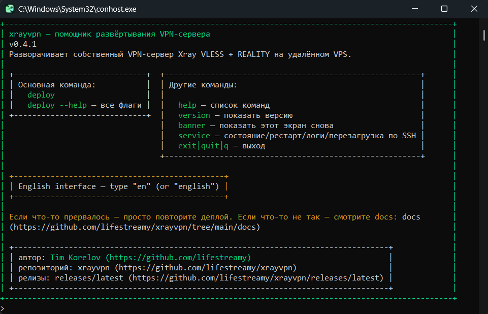
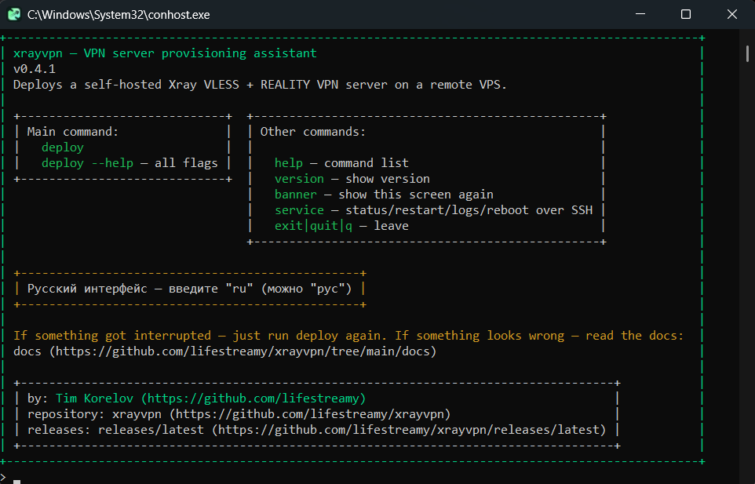
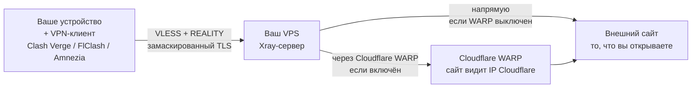

[](README.en.md)
[](README.md)

<p align="center">
  
</p>

# Xray Reality VPN Server — развёртывание

[](https://github.com/lifestreamy/xrayvpn/releases/latest)
[](https://pypi.org/project/xrayvpn/)
[](python-client/README.md)
[](LICENSE)

> VLESS Xray Reality + опциональный исходящий Cloudflare WARP. Личный VPN-сервер на своём VPS
> Ubuntu/Debian без покупки домена: достаточно IP и пароля root.
> Консольный Python-клиент для всех платформ (Ubuntu/Debian/Arch | Windows | macOS): готовый файл
> сборки или запуск из терминала; установка — pip или apt (Ubuntu 24.04 / Debian 12).
> Ядро развёртывания — Ansible. Готовые конфигурации клиентов (Amnezia / Clash Verge / FlClash)
> генерируются и скачиваются к вам на машину. Дальше — [планы](docs/user/PLANNED.md).

<table>
  <tr>
    <td></td>
    <td></td>
  </tr>
</table>

## Содержание

- [Привет](#привет)
- [Быстрый старт](#быстрый-старт)
- [Для кого это](#для-кого-это)
- [Что делает и в чём смысл](#что-делает-и-в-чём-смысл)
- [Преимущества подхода](#преимущества-подхода)
- [Требования](#требования)
- [Конфигурация](#конфигурация)
- [Структура репозитория](#структура-репозитория)
- [Клиенты](#клиенты)
- [Подробная документация](#подробная-документация)
- [Лицензия](#лицензия)
- [Автор и контакты](#автор-и-контакты)

## Привет!

Привет, это [Тим Корелов](https://korelov.dev). Делюсь собственным решением для развёртывания
персонального VPN — можете свободно использовать его для защиты персональных данных (и согласно
законам своей страны, разумеется...). Прочитайте правила лицензии.

> [!TIP]
> [Быстрый старт](#быстрый-старт).

Зачем я всё это сделал? Мой сервер — мои правила.

- никто не слушает и не логирует; мне не нужно верить кому-то на слово, я полностью контролирую, что происходит на сервере, куда идёт трафик;
- чужой сервис может в любой момент изменить условия или стать недоступным, особенно если у него большая база клиентов;
- канал на чужом сервисе делится неравномерно, соединения пользователей влияют друг на друга;
- можно в любой момент обновлять компоненты и настраивать сервис под себя.

Всё автоматизировано, чтобы не настраивать руками каждый раз.

<details>
<summary>Используется Ansible</summary>

Почему:

- идемпотентен: повторный запуск не ломает сервер, а приводит его к нужному виду;
- расширяется ролями и готовыми модулями;
- показывает каждое изменение;
- декларативен: вы описываете состояние, а не последовательность команд. При этом разрешает
  императивный код.

Ставится на VPS (remote-режим) или работает с вашей машины (local-режим, на Windows — через WSL).
</details>

Проект полностью покрыт автоматическими тестами для всех платформ, я провожу ручное тестирование и выверяю UI/UX перед каждым релизом, чтобы всё работало как надо и было удобным для пользователей; проверяю документацию на читаемость и понятность.

И, главное — сам постоянно пользуюсь этим приложением (т.н. "dogfooding"), поэтому поломки вижу сразу на себе и правлю.

Нашли ошибку или что-то не запускается — создайте issue или попробуйте написать в discussions. Если перестал работать развёрнутый VPN —
сначала [`docs/user/RUNBOOK.md`](docs/user/RUNBOOK.md).

## Быстрый старт

| Путь | Что нужно | Как | Комментарий |
|---|---|---|---|
| Портативное приложение | один скачанный файл, ставить ничего не надо | скачать из [Releases](https://github.com/lifestreamy/xrayvpn/releases/latest) и запустить (Windows — двойной клик), набрать `deploy` | консольное приложение |
| Пакетные менеджеры | менеджер пакетов | `pip install xrayvpn` (Python 3.12+), apt (Ubuntu 24.04 / Debian 12) | установка одной командой |
| Из репозитория | `uv` (поставит Python 3.12+) | `uv run --project python-client xrayvpn deploy` | запуск из исходников |
| Shell-обёртки | Linux/WSL (bash) или Windows+WSL (PowerShell) | `provision-vpn.sh` / `Provision-VPN.ps1` | поддержка без развития |
| Ansible напрямую | ansible-core 2.14+ и `community.general` | `ansible-playbook -i inventory.yml deploy.yml` | для технарей |

Что нужно в любом случае: VPS (свежий Ubuntu 20.04+/Debian 11+, root/sudo, публичный IP) и
SSH-доступ к нему — пароль или ключ. Инструкция по установке — [`docs/user/SETUP.md`](docs/user/SETUP.md).

<details>
<summary>Установка по платформам — команды</summary>

**Windows:** скачайте `xrayvpn-<версия>-windows-x64-portable.exe` из
[Releases](https://github.com/lifestreamy/xrayvpn/releases/latest) и запустите двойным кликом.

**macOS (Apple Silicon):** скачайте `xrayvpn-<версия>-macos-arm64-portable`:

```bash
chmod +x xrayvpn-*-macos-arm64-portable
./xrayvpn-*-macos-arm64-portable
```

**Linux (Ubuntu 24.04 / Debian 12)** — apt-репозиторий:

```bash
sudo curl -fsSL -o /usr/share/keyrings/xrayvpn-archive-keyring.gpg \
  https://lifestreamy.github.io/xrayvpn/apt/xrayvpn-archive-keyring.gpg
echo "deb [signed-by=/usr/share/keyrings/xrayvpn-archive-keyring.gpg] https://lifestreamy.github.io/xrayvpn/apt/ $(. /etc/os-release; echo $VERSION_CODENAME) main" \
  | sudo tee /etc/apt/sources.list.d/xrayvpn.list
sudo apt update && sudo apt install xrayvpn
```

Отпечаток ключа: `60DA D207 F0BE 147C 5830 D3D8 1BD4 9EC3 0480 57D3`.
Другие дистрибутивы — готовые сборки из Releases (`chmod +x`, запуск
`./xrayvpn-*-linux-x64-portable`) или `.deb`: `sudo apt install ./xrayvpn_*_amd64.deb`.

**Любая ОС с Python 3.12+:** `pip install xrayvpn`; на Debian/Ubuntu системный pip заблокирован —
`sudo apt install pipx && pipx install xrayvpn`.

</details>

Приложение консольное, но не пугайтесь: можете ошибаться с командами — ничего не сломается.

- `ru` — русский интерфейс, `help` — основная помощь на выбранном языке.
- `deploy` — главная команда, `deploy --help` — справка по ней. Без параметров `deploy` спросит
  IP VPS и пароль (скрыто), покажет план и выполнит его после подтверждения.
- `service` — состояние системы и развёртывания, например `service status`.

<details>
<summary>Python-клиент из репозитория — команды</summary>

Работает одинаково на Windows, Linux и macOS; для удалённого режима WSL не нужен.

```bash
# Удалённый режим (VPS). Достаточно IP — пароль спросит скрыто.
uv run --project python-client xrayvpn deploy --execution remote --host 1.2.3.4
uv run --project python-client xrayvpn deploy --execution remote --use-inventory
```

Нет `uv`? Windows: `powershell -ExecutionPolicy ByPass -c "irm https://astral.sh/uv/install.ps1 | iex"`,
Linux/macOS: `curl -LsSf https://astral.sh/uv/install.sh | sh`.

Голой `xrayvpn` в PATH без префикса — `uv tool install --editable python-client` из корня
репозитория; запускать из папки репозитория. Остальное — в [`python-client/README.md`](python-client/README.md).

</details>

<details>
<summary>Shell-обёртки — команды</summary>

На Windows bash-обёртке нужен WSL с Ubuntu/Debian (откройте терминал: Win + S → «PowerShell» или
«Terminal»; подробности — [`docs/user/SETUP.md`](docs/user/SETUP.md)).

```bash
./shell-clients/bash/provision-vpn.sh -H 1.2.3.4
./shell-clients/bash/provision-vpn.sh -H 1.2.3.4 --pkey ~/.ssh/id_rsa
./shell-clients/bash/provision-vpn.sh --use-inventory
```

```powershell
.\shell-clients\powershell\Provision-VPN.ps1 -HostName 1.2.3.4
.\shell-clients\powershell\Provision-VPN.ps1 -HostName 1.2.3.4 -PKey C:\Users\You\.ssh\id_rsa
```

</details>

<details>
<summary>Ansible напрямую — команды</summary>

Нужны ansible-core 2.14+ и коллекция `community.general`. `inventory.yml` — из шаблона
(`cp inventory.yml.example inventory.yml`, в PowerShell — `Copy-Item`).

```bash
pip install ansible-core
ansible-galaxy collection install community.general
ansible-playbook -i inventory.yml deploy.yml
```

</details>

## Для кого это

Для тех, кто хочет свой VPN и не готов полагаться на чужие сервисы. Разбираетесь в Ansible, Xray
и серверах или нет — скрипт сделает всё сам. Технические детали — в раскрывающихся блоках и в
[`docs/user/GLOSSARY.md`](docs/user/GLOSSARY.md).

## Что делает и в чём смысл

- Поднимает VPN-сервер на вашем VPS за один запуск.
- Трафик идёт через ваш сервер в зашифрованном виде; никто его не читает и не логирует.
  В публичном VPN-сервисе такой уверенности нет — особенно на «бесплатном» тарифе.
- Вы не зависите от провайдера VPN: аптайма, цен, ограничений; канал не разделён с чужими
  пользователями.
- Сервер ваш: функции и настройки выбираете вы.
- Генерирует готовые конфигурации клиентов: Clash Verge / FlClash / Amnezia.



Конечная цель — внешний сайт. Он видит IP вашего устройства или провайдера при раздельном туннеле,
IP вашего VPS — при обычном туннеле, IP Cloudflare — при включённом WARP.

> В планах — визуальный клиент с простым интерфейсом. Список планов —
> в [`docs/user/PLANNED.md`](docs/user/PLANNED.md).

<details>
  <summary>Подробности для технарей</summary>

  Реальный стек: Ansible-роль `roles/xray_vpn/`, шаблоны Jinja2, Docker-образ
  `teddysun/xray:26.6.27`, персистентное состояние `/root/xray-config/reality-state.json`.
  Транспорт — VLESS + REALITY (модифицированный TLS 1.3, X25519). Опционально — исходящий
  туннель через Cloudflare WARP.

</details>

## Преимущества подхода

Xray VLESS + REALITY не требует своего домена и TLS-сертификата: сервер маскируется под легитимный
сайт (`reality_camouflage_domain`, по умолчанию `dl.google.com`). Не нужно покупать домен,
получать и продлевать сертификат, настраивать DNS.

Ядро — [Xray-core](https://github.com/XTLS/Xray-core). По умолчанию ставится нативно
(`/usr/local/xray/xray`, systemd, `xray_runtime: native` — минимальный footprint, рекомендуемый);
есть `docker`-вариант.

## Требования

**VPS:** свежий Ubuntu 20.04+ или Debian 11+, root или sudo, публичный IP. Подскажу проверенных
провайдеров — буду признателен за регистрацию по моей реферальной ссылке.

**Ваша машина:** для портативного приложения — ничего; для пакетных менеджеров — сам менеджер; для
репозитория — `uv` (поставит Python 3.12+); для shell-обёрток — Linux/WSL (на Windows — WSL2
с Ubuntu/Debian). SSH-доступ к VPS — по ключу или паролю (встроенный `paramiko`, `sshpass` не нужен).

Серверу не нужен GitHub и git: playbook и роли передаются на VPS одним архивом по SSH — клонирование
на сервере не делается.

WARP включён по умолчанию; отключить — `--no-warp` при развёртывании. В репозитории/Ansible то же
задаётся как `warp_enabled` в `config/settings.yml`.

Перед оплатой VPS на долгий срок проверьте его — [`docs/user/TEST-VPS.md`](docs/user/TEST-VPS.md).

## Конфигурация

Раздел для продвинутых. Минимум — IP и пароль, остальное по умолчанию. Параметры подключения:

- CLI-флагами: `-H/--host`, `-u/--user`, `-p/--port`, `--pkey` или `--pass` (взаимоисключающие,
  без них — скрытый запрос). Алиас хоста из `~/.ssh/config` работает как в ssh.
- Через `inventory.yml` и `--use-inventory`: создайте из шаблона
  (`cp inventory.yml.example inventory.yml`, в PowerShell — `Copy-Item`), заполните `ansible_host`,
  `ansible_user`, `ansible_port` и `ansible_ssh_private_key_file` или `ansible_ssh_pass`.
  Файл в `.gitignore` — личные данные в git не попадут.

Параметры сервера (число клиентов, WARP, порт, домен маскировки) — `config/settings.yml`.
Подробнее — [`docs/user/SETUP.md`](docs/user/SETUP.md).

Пользовательские файлы портативного приложения лежат рядом с ним: `config/settings.yml` и
`inventory.yml` подхватываются из папки приложения (или `$XRAYVPN_HOME`) и перекрывают встроенные
значения.

## Структура репозитория

- `python-client/` — основной клиент (Python, CLI `xrayvpn`) и standalone-сборки;
- `shell-clients/` — Bash и PowerShell-обёртки (поддержка без развития);
- `scripts/` — инструменты разработки;
- `config/`, `roles/`, `deploy.yml` — Ansible-проект;
- `docs/user/` и `docs/dev/` — документация (см. ниже).

## Клиенты

Пользуюсь Clash Verge (Windows) и FlClash (Android). Amnezia работает, но нестабилен — рекомендую
Mihomo-клиенты. Что и где проверено — [`docs/user/CLIENT-STATUS.md`](docs/user/CLIENT-STATUS.md).

## Подробная документация

Пользователю:

- [`docs/user/SETUP.md`](docs/user/SETUP.md) — установка и первый запуск;
- [`docs/user/RUNBOOK.md`](docs/user/RUNBOOK.md) — VPN перестал работать: по шагам;
- [`docs/user/ROTATION.md`](docs/user/ROTATION.md) — смена ключей и клиентов;
- [`docs/user/TEST-VPS.md`](docs/user/TEST-VPS.md) — проверка VPS перед оплатой;
- [`docs/user/GLOSSARY.md`](docs/user/GLOSSARY.md) — термины;
- [`docs/user/PLANNED.md`](docs/user/PLANNED.md) — что появится дальше.

Разработчику:

- [`docs/dev/RELEASE.md`](docs/dev/RELEASE.md) — релизная политика;
- [`docs/dev/TEST-LOCAL.md`](docs/dev/TEST-LOCAL.md) — локальный сквозной тест;
- [`CHANGELOG.md`](CHANGELOG.md) — история версий;
- [`python-client/README.md`](python-client/README.md) и [`python-client/BUILD.md`](python-client/BUILD.md)
  — клиент и его сборка.

## Лицензия

AGPL-3.0 с дополнительным ограничением коммерческого использования. Свободно для личного
использования и некоммерческого распространения. Коммерческое использование — только с моего
письменного разрешения: **tim.korelov@yandex.com**. Полный текст — в [`LICENSE`](LICENSE)
(English), краткое описание на русском — в [`LICENSE.ru.md`](LICENSE.ru.md).

## Автор и контакты

Tim Korelov — https://korelov.dev

Почта: **tim.korelov@yandex.com**
Telegram: **@timkore** (рабочий) — по вопросам проекта, предложениям о работе и приглашениям.
